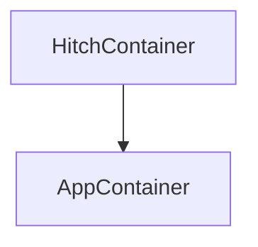
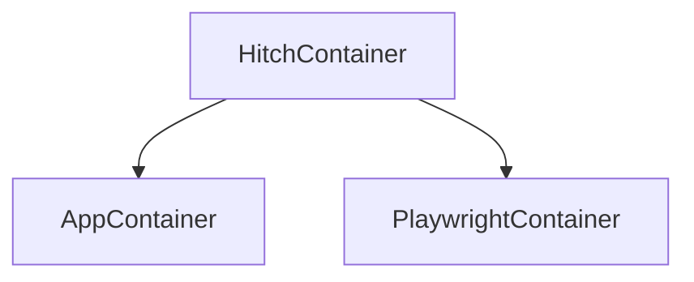

# HitchStory Examples

[](https://raw.githubusercontent.com/hitchdev/examples/main/.github/hitchstory-screenshots.png)

The following are four rudimentary to do apps each tested with
[HitchStory](https://hitchdev.com/hitchstory), a
[StrictYAML based](https://hitchdev.com/hitchstory/why/strictyaml)
FOSS python integration testing framework.

*Unlike* with other testing frameworks these declarative stories can:

* **autogenerate beautiful documentation** with a minimal amount of effort.
* **rewrite themselves from program output**
* are **type-safe**

To do App | Storytests | Cool Features | Story Engine
---|---|---|---
Website | [add todo](https://github.com/hitchdev/examples/tree/main/website/story/add-todo.story), [correct spelling](https://github.com/hitchdev/examples/tree/main/website/story/correct-my-spelling.story) | [Autogenerated add todo docs](https://github.com/hitchdev/examples/blob/main/website/docs/add-and-retrieve-todo.md) and [correct my spelling](https://github.com/hitchdev/examples/tree/main/website/docs/correct-my-spelling.md) docs including playwright generated GIFs and screenshots. | [engine.py](https://github.com/hitchdev/examples/tree/main/website/hitch/engine.py)
REST API | [add todo](https://github.com/hitchdev/examples/tree/main/restapi/story/add-todo.story), [correct spelling](https://github.com/hitchdev/examples/tree/main/restapi/story/correct-my-spelling.story) | [Autogenerated docs](https://github.com/hitchdev/examples/tree/main/restapi/docs), API responses in story self-rewrite | [engine.py](https://github.com/hitchdev/examples/tree/main/restapi/hitch/engine.py)
Interactive command line app | [add todo](https://github.com/hitchdev/examples/tree/main/commandline/story/add-todo.story), [correct spelling](https://github.com/hitchdev/examples/tree/main/commandline/story/correct-my-spelling.story) | [Autogenerated docs](https://github.com/hitchdev/examples/tree/main/commandline/docs), Command line outputs in story self-rewrite | [engine.py](https://github.com/hitchdev/examples/tree/main/commandline/hitch/engine.py)
Python API | [add todo](https://github.com/hitchdev/examples/tree/main/pythonapi/story/add-todo.story), [correct spelling](https://github.com/hitchdev/examples/tree/main/pythonapi/story/correct-my-spelling.story) | [Autogenerated docs](https://github.com/hitchdev/examples/tree/main/pythonapi/docs), print() outputs from python in stories self-rewrites | [engine.py](https://github.com/hitchdev/examples/tree/main/pythonapi/hitch/engine.py)

All of the above tests are also running on Github Actions with [no tweaks](https://github.com/hitchdev/examples/blob/main/.github/workflows/regression.yml):

[](https://github.com/hitchdev/examples/actions/workflows/regression.yml)

If you'd like help with introducing capabilities like these to your project, [contact me now](hitchdev.com/consulting) for a free consultation.

## Run them yourself

**Podman must be installed on your system first.**

All other functionality is automated and can be run via one of the 
four key.sh scripts.

To begin:

```bash
$ git clone https://github.com/hitchdev/examples.git
$ cd examples/commandlib -OR- restapi -OR- website -OR- pythonapi
$ ./key.sh make
```

## Run all tests

```
$ ./key.sh regression
```

## Run a single test

This command can be used to craft a new feature and do
acceptance test driven development on it:

```
$ ./key.sh atdd correct
```

"correct" is a unique keyword used in the name of one of the stories.

## Run singular test in rewrite mode

If you change the REST API JSON response, the command line output, etc.
and run "./key.sh build" and then run this it will rewrite that story:

```
$ ./key.sh ratdd correct
```

## Generate documentation from stories

This will regenerate all of the markdown docs for that project:

```
$ ./key.sh docgen
```

For the website project, the screenshots and video artefacts
used by the markdown can be regenerated by running:

```
$ ./key.sh recordings
```

> **Warning**
>You might have to fork this project and push changes to preview the github-flavored markdown with videos and images.


## Clean up everything

This will delete everything created to run these tests (container/volume):

```
$ ./key.sh clean all
```


> **Note**
>It must be run in each project folder you ran ./key.sh make in.

# About the projects

The four folders contain four versions of the same project -
[this great little to do app](https://github.com/ovinokurov/ToDo)
built by [Oleg Vinokurov](https://github.com/ovinokurov) which was built
with a command line, REST and web interface.

For the pythonapi project everything is just run in the Hitch container (test and code-under-test in separate virtualenvs).

The interactive command line app and REST API have a podman-in-podman:



While the website app is tested with a parent hitch container building and running the app and playwright containers:



This is done to segregate the test code from the application code.


# Future work on this repo

- [ ] Mount code folder with podman so "./key build" is unnecessary after code changes.
- [ ] Integrate containerized postgres running with all of the apps, seeded with [given preconditions](https://hitchdev.com/hitchstory/using/given/).
- [ ] Mock the passage of time with a step - implement reminders into the to do apps.
- [ ] Handle a REST API response which returns a different UUID each time it is called.
- [ ] Demonstrate story inheritance (e.g. logging in story -> add todo) using all of the [currently documented inheritance features listed here](https://hitchdev.com/hitchstory/using/).

Have suggestions? What kind of gnarly integration tests would you find most interesting? Raise an issue if you have more ideas.
