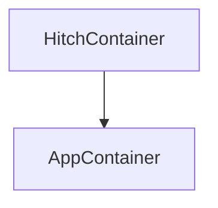
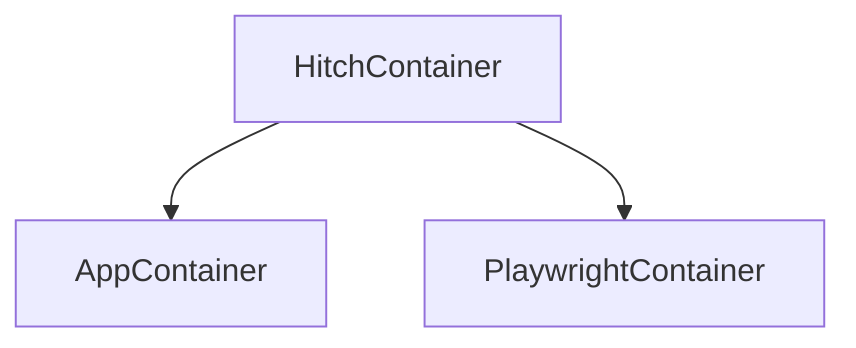

# HitchStory: Tests that rewrite themselves. Tests that rewrite your docs.

This repo contains four demonstration to do apps, each tested with
[HitchStory](https://hitchdev.com/hitchstory), a
[StrictYAML based](https://hitchdev.com/hitchstory/why/strictyaml)
open source python integration testing framework.

These tests can:

## Rewrite themselves

[](http://www.youtube.com/watch?v=Aqk5Sao27O0 "Test rewriting itself")

## Rewrite documentation

At the top of these is the YAML story, beneath it a screenshot of part of the docs:

<table>
  <tr>
    <td>Web (YAML story -> Markdown docs)</td>
    <td>REST API (story -> docs)</td>
    <td>Interactive CLI (story -> docs)</td>
    <td>Python API (story -> docs)</td>
  </tr>
  <tr>
    <td> </td>
    <td></td>
    <td></td>
    <td></td>
  </tr>
 </table>


## See the code

To do App | Storytests | Cool Features | Story Engine | Doc template
---|---|---|---|---
Website | [add todo](https://github.com/hitchdev/examples/tree/main/website/story/add-todo.story), [correct spelling](https://github.com/hitchdev/examples/tree/main/website/story/correct-my-spelling.story) | [Autogenerated add todo docs](https://github.com/hitchdev/examples/blob/main/website/docs/add-and-retrieve-todo.md) and [correct my spelling](https://github.com/hitchdev/examples/tree/main/website/docs/correct-my-spelling.md) docs including playwright generated GIFs and screenshots. | [engine.py](https://github.com/hitchdev/examples/tree/main/website/hitch/engine.py) | [docstory.yml](https://github.com/hitchdev/examples/tree/main/website/hitch/docstory.yml)
REST API | [add todo](https://github.com/hitchdev/examples/tree/main/restapi/story/add-todo.story), [correct spelling](https://github.com/hitchdev/examples/tree/main/restapi/story/correct-my-spelling.story) | [Autogenerated docs](https://github.com/hitchdev/examples/tree/main/restapi/docs), API responses in story self-rewrite | [engine.py](https://github.com/hitchdev/examples/tree/main/restapi/hitch/engine.py)  | [docstory.yml](https://github.com/hitchdev/examples/tree/main/restapi/hitch/docstory.yml)
Interactive command line app | [add todo](https://github.com/hitchdev/examples/tree/main/commandline/story/add-todo.story), [correct spelling](https://github.com/hitchdev/examples/tree/main/commandline/story/correct-my-spelling.story) | [Autogenerated docs](https://github.com/hitchdev/examples/tree/main/commandline/docs), Command line outputs in story self-rewrite | [engine.py](https://github.com/hitchdev/examples/tree/main/commandline/hitch/engine.py) | [docstory.yml](https://github.com/hitchdev/examples/tree/main/commandline/hitch/docstory.yml)
Python API | [add todo](https://github.com/hitchdev/examples/tree/main/pythonapi/story/add-todo.story), [correct spelling](https://github.com/hitchdev/examples/tree/main/pythonapi/story/correct-my-spelling.story) | [Autogenerated docs](https://github.com/hitchdev/examples/tree/main/pythonapi/docs), print() outputs from python in stories self-rewrites | [engine.py](https://github.com/hitchdev/examples/tree/main/pythonapi/hitch/engine.py) | [docstory.yml](https://github.com/hitchdev/examples/tree/main/pythonapi/hitch/docstory.yml)

All of the above tests are also running on Github Actions with [no tweaks](https://github.com/hitchdev/examples/blob/main/.github/workflows/regression.yml):

[](https://github.com/hitchdev/examples/actions/workflows/regression.yml)

## Run them yourself

**Podman must be installed on your system first.**

All other functionality is automated and can be run via one of the 
four key.sh scripts.

To begin:

```bash
$ git clone https://github.com/hitchdev/examples.git
$ cd examples/commandlib -OR- restapi -OR- website -OR- pythonapi
$ ./key.sh make
```

This downloads and builds the container and python packages the
tests need to run in an isolated environment.


## Run all tests

```
$ ./key.sh regression
```

## Run a singular test from a unique keyword

The command for [acceptance test driven development](https://en.wikipedia.org/wiki/Acceptance_test-driven_development):

```
$ ./key.sh atdd correct
RUNNING Add and retrieve todo in /src/story/add-todo.story ... SUCCESS in 3.5 seconds.
```

## Run singular test in rewrite mode

If you tweak the wordings in the command line app and run this, it will
update the story accordingly.

```
$ ./key.sh ratdd correct
RUNNING Add and retrieve todo in /src/story/add-todo.story ... SUCCESS in 3.5 seconds.
```

For the REST API project, it will rewrite the REST API responses. For the Python API project it will rewrite the expected output. For the website app, it retakes the screenshot and video used in the markdown docs.

Rewrite behavior is controlled from `engine.py` - see where `self._rewrite` is used to see how.

## Regenerate documentation from stories

This will regenerate all of the markdown docs for the project:

```
$ ./key.sh docgen
```

For the website project, the screenshots and video artefacts
used by the markdown can all be regenerated by running:

```
$ ./key.sh recordings
```

## Clean up everything

When ./key.sh make is run on any of these 4 project, it will create one podman image and one volume
each. This command cleans them both up:

```
$ ./key.sh clean all
```

# About the projects

The four folders contain four versions of the same project -
[this great little to do app](https://github.com/ovinokurov/ToDo)
built by [Oleg Vinokurov](https://github.com/ovinokurov) which was built
with a command line, REST and web interface.

For the pythonapi project everything is just run in the Hitch container (test and code-under-test in separate virtualenvs).

The interactive command line app and REST API have a podman-in-podman:



While the website app is tested with a parent hitch container building and running the app and playwright containers:



This is done to segregate the test code from the application code.


# Future work on this repo

- [ ] Integrate containerized postgres running with all of the apps, seeded with [given preconditions](https://hitchdev.com/hitchstory/using/given/).
- [ ] Mock the passage of time with a step - implement reminders into the to do apps.
- [ ] Handle a REST API response which returns a different UUID each time it is called.
- [ ] Demonstrate story inheritance (e.g. logging in story -> add todo) using all of the [currently documented inheritance features listed here](https://hitchdev.com/hitchstory/using/).

Have suggestions? What kind of gnarly integration tests would you find most interesting? Raise an issue if you have more ideas.
